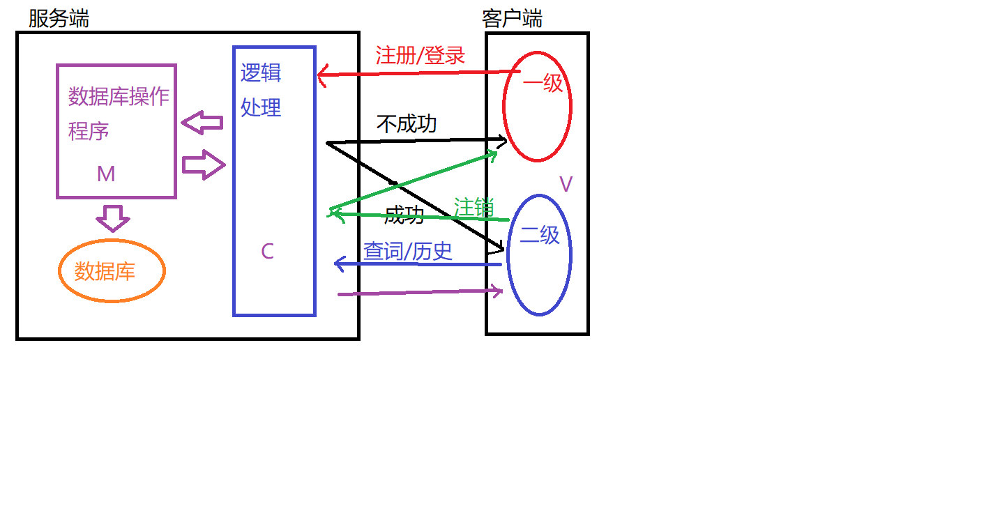

# 在线词典
## 需求分析
### 建立整体结构（软件怎么用）
```
   * MVC架构
```

### 研究技术方案，确定细节
```
   * 确定并发方案？ --> Multiprocess
   * 哪种套接字？   --> TCP
   * 二级界面结构   --> 循环嵌套，封装调用
```
### 数据库设计
```
   * 分析存储内容
   * 确定字段构成
     1. 用户信息：用户名 密码
     2. 词典：单词 解释
     3. 历史记录(关系表)：用户名 单词 时间
   * 设计字段类型
   * 建表
```
### 结构设计
```
   * 如何封装 --> 类
   * 几个模块
     1. 客户端
     2. 服务端
          逻辑功能模块
          数据处理模块
   * 模块功能
```
### 搭建通信（通信协议）
### 具体功能分析，逐个模块实现
```
   * 并发通信
   * 注册
     + 客户端： --> TCP三次握手
        1. 发送请求 R name password
        2. 等待结果(成功/失败)
     + 服务端：
        1. 接受请求 解析请求 
        2. 根据请求类型调用功能函数
        3. 数据请求 返回结果
   * 登录(功能基本同注册)
     + 客户端：
        1. 发送请求 L name password
        2. 等待结果(成功/失败)
     + 服务端：
        1. 接受请求 解析请求 
        2. 根据请求类型调用功能函数
        3. 数据请求 返回结果
   * 查单词
     + 客户端：
        1. 输入单词 发送请求 Q name word
        2. 接收结果
     + 服务端：
        1. 接收单词
        2. 查询单词
        3. 给客户端发送结果
        4. 插入历史记录(关系表)
   * 历史记录
        1. 发送请求 H name
        2. 接收结果
     + 服务端：
        1. 接收请求，解析请求
        2. 重写新的历史记录表 id  name  word  time
        3. 给客户端发送结果
```